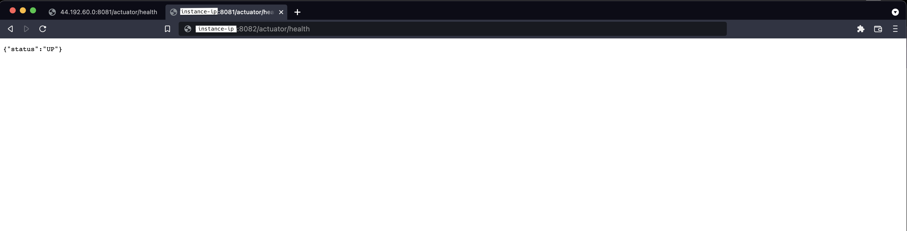

# Getting started

## Prerequisites
Before start setting please make sure you have create your aws account before

## Using AWS console
1. login into your aws account and move to ec2 folder


2. select AMI Catalog and search fro mondial wallet ami ( eu-central-1: ami-09fb61f3816d06b93, eu-west-1: ami-01aa2dd4544976943, us-east-1: ami-047db6a2c490cbdab, us-east-2: ami-094629b9dcb88a9d5 )


3. Select the AMI and click on launch with AMI


4. filled in the necessary information to start the instance and launch it


5. Wait for the app to be ready and check if they are up <br>
Dial-data

Dial-relay


## Using AWSCLI (WIP...)
## Step1: Prepare your system

1. Install terraform `brew install terraform && terraform --version`
2. Download and install the AWS cli
3. Create a user in your aws console  with the `AdministratorAccess` policy. The user have an `Access key ID` and a `Secret access key`
4. Configure your computer's awscli to be able to authenticate on aws. Use the previously generated `Access key ID` and `Secret access key`
5. Test `aws s3 ls`. If well configured, it should list your s3 bucket content.


## Step2: Start the deployment

### Terraform init
1. If not already done, clone this repository
2. Step into the aws folder`$cd deployment/examples/aws`
3. Run `$terraform init`. This command will clone the project and down load all the terraform required modules. If executed sucessfuly you should get a message `Terraform has been successfully initialized!`

### Update properties

You can update the file `examples/aws/variables` to reflect your deployement. i.e you can choose to change the region, the prefix, the stage name etc...

```
variable "region" {
  default = "eu-central-1"
}
variable "prefix" {
  default = "DialchainRelay"
}

variable "stage_name" {
  default = "TestEnv"
}

...

variable "container-name" {
  default = "test-env-dial-relay"
}

```

### Plan and Deploy

After changing the properties, run:

```bash
$terraform plan
$terraform apply (enter yes in the prompt)
```

If successfully executed, you should get the following print in the console `Apply complete! Resources: 17 added, 0 changed, 0 destroyed.`

### Removing all deployments

After successfully deployment, you can teardown the infrastructure by running `terraform destroy` (enter yes in the prompt).
If successfully executed, you should get a message `Destroy complete! Resources: 17 destroyed.`
